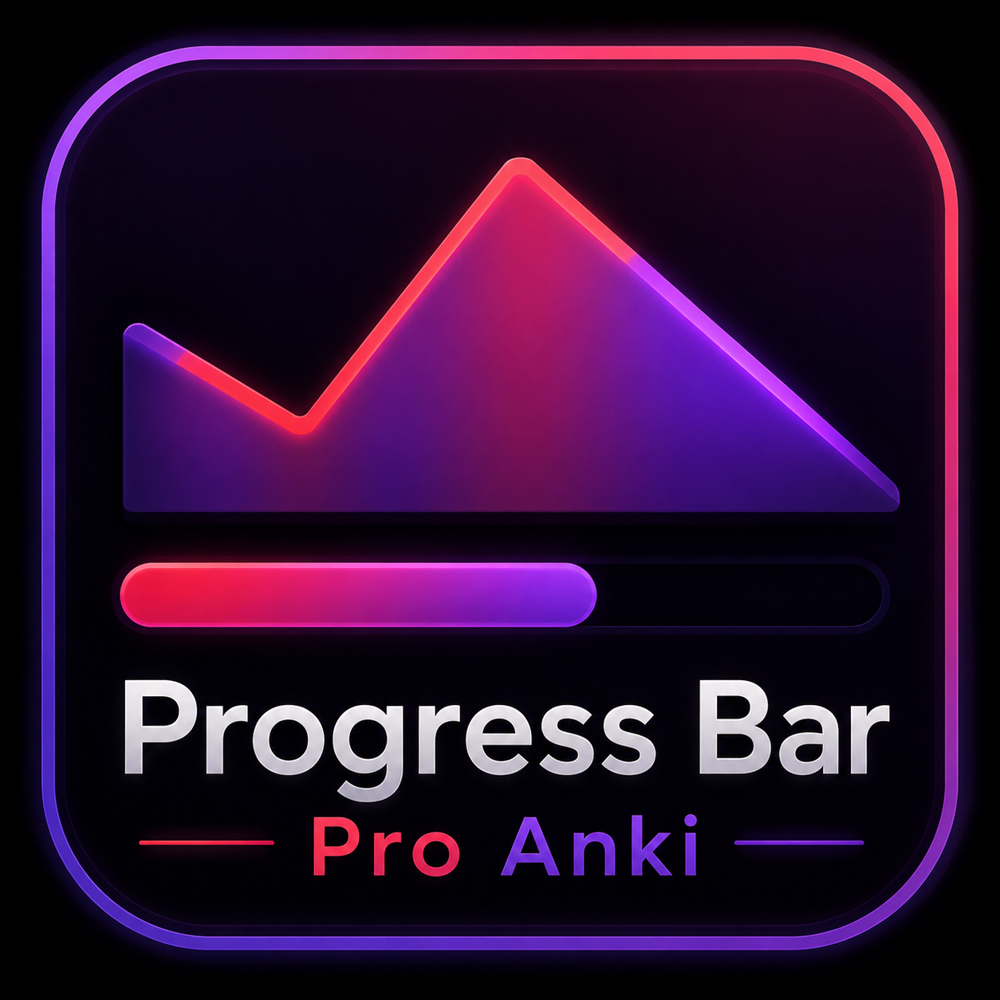
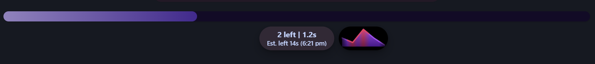
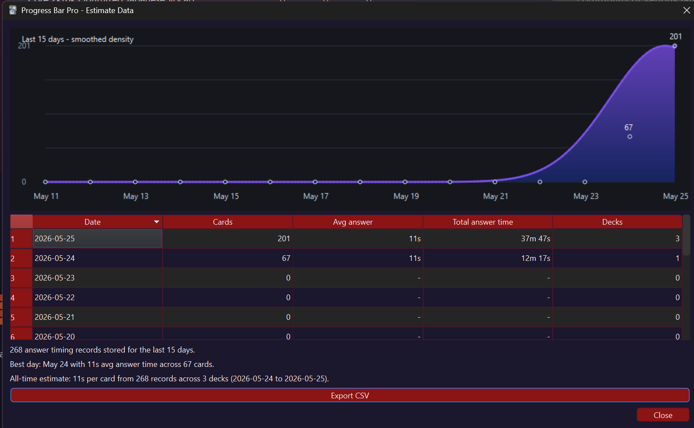

  

# Progress Bar Pro

Progress Bar Pro is an Anki reviewer add-on that adds a configurable progress
bar, answer bubble, and answer-time mini chart while you study.

The installable add-on package is:

`progress_bar_pro.ankiaddon`

## Screenshots

### Reviewer Overlay

### Estimate Data

## Features

- Reviewer progress bar with configurable filled and unfilled colors.
- Center bubble showing cards left, progress count, percent done, or another preset.
- Optional last-answer time in the bubble.
- Optional estimated time remaining and estimated finish time.
- Optional mini area chart showing the last 5 answer times.
- Separate Good/Hard/Easy and Again gradients for the mini answer-time chart.
- Again answers blend a soft red band into the mini chart instead of recoloring the whole graph.
- Optional always-visible bubble and chart mode.
- Top or bottom progress bar placement, with spacing to avoid covering the card.
- Estimate data viewer with a 15-day history graph, all-time summary, and CSV export.
- Import/export for the timing history JSON database.

## Install

In Anki desktop:

1. Open `Tools -> Add-ons`.
2. Choose `Install from file...`.
3. Select `progress_bar_pro.ankiaddon` from this folder.
4. Restart Anki if prompted.

## Menu

After installation, open:

`Tools -> Progress Bar Pro`

The submenu contains:

- `Options`
- `View estimate data`

## Options

Options are organized into tabs.

### General

- `Bubble display`: choose what the bubble shows without typing placeholders.
- `Bubble time`: how long the bubble appears after answering.
- `Show answer time`: appends the last answer duration to the bubble.
- `Show answer time chart`: displays the mini chart beside the bubble.
- `Keep bubble and chart on screen`: keeps both visible instead of animating after each answer.
- `Show estimated time left`: adds estimated remaining study time.
- `Show estimated finish clock time`: adds the projected finish time.
- `Position`: place the progress bar near the bottom controls or in the top area.

### Colors

Color settings are grouped by what they affect:

- `Progress bar`: filled and unfilled bar colors.
- `Bubble`: bubble background and text colors.
- `Answer time chart`: Good/Hard/Easy gradient and Again gradient.
- `Estimate history chart`: gradient used in the estimate data window.

### Data

- `Database location`: optionally choose where `timing_history.json` and
  `daily_progress.json` are stored.
- `Estimate history`: export or import the timing history JSON database.

## How Timing Works

Progress Bar Pro times each review answer from when the question is shown until
you press an answer button. It uses those answer durations to:

- Display the latest answer time.
- Plot the last 5 answers in the mini chart.
- Improve estimated time remaining.
- Build the estimate data history view.

Answer timing is tracked regardless of whether you pass or fail the card. Again
answers are marked visually in the mini chart with the configured Again gradient.

## Stored Data

By default, timing history is stored at:

`progress_bar_pro/user_files/timing_history.json`

Today's per-deck progress and mini answer-time chart are stored at:

`progress_bar_pro/user_files/daily_progress.json`

Saved options are handled by Anki's add-on config system and mirrored to:

`progress_bar_pro/user_files/settings_backup.json`

Those files are kept under `user_files` so normal add-on updates preserve them.

## Compatibility

The add-on manifest targets Anki 25.09 or newer.
